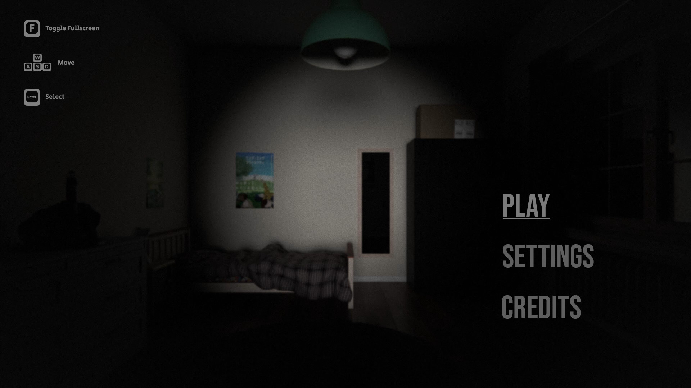
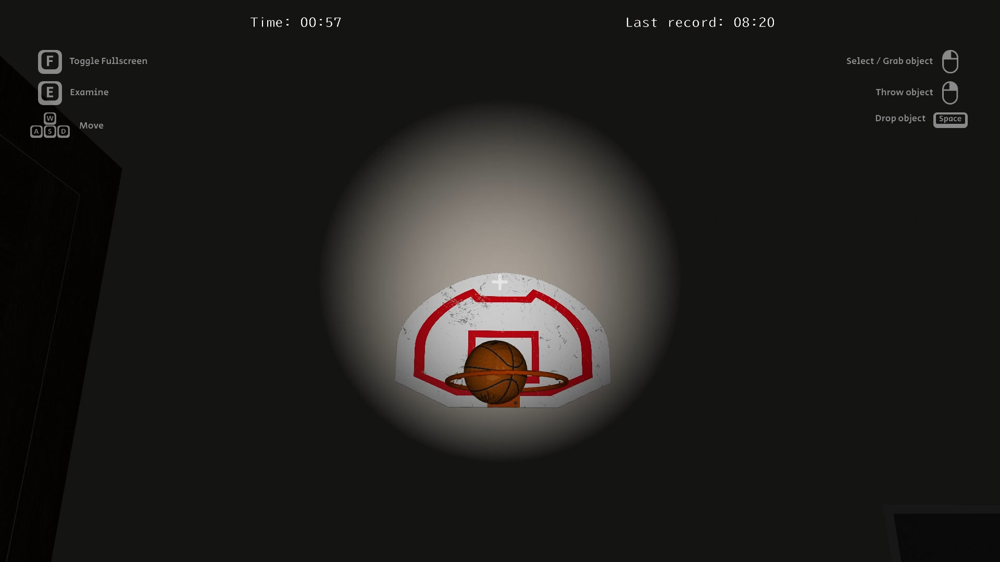

# OpenGL Escape Room

**A videogame developed in C++ using the OpenGL API for the Computer Graphics course at Politecnico of Torino.**

The game has been developed using [Microsoft Visual Studio](https://visualstudio.microsoft.com/), [Blender](https://www.blender.org/) and [Adobe Photoshop 2022](https://www.adobe.com/it/products/photoshop.html).

## Libraries

- [GLEW 2.2.0](https://github.com/nigels-com/glew) to load modern OpenGL functions.
- [GLFW 3.3.7](https://github.com/glfw/glfw) for window creation and input handling.
- [Bullet 3.25](https://github.com/bulletphysics/bullet3) for physics calculations.
- [Assimp 5.2.4](https://github.com/assimp/assimp) to load 3D models.
- [stb_image.h 2.28](https://github.com/nothings/stb/blob/master/stb_image.h) for image loading.
- [GLM 0.9.9.8](https://github.com/g-truc/glm) for mathematical operations on matrices and vectors.

## Note

Media files (textures, models, etc.) and external libraries are missing in this repository.